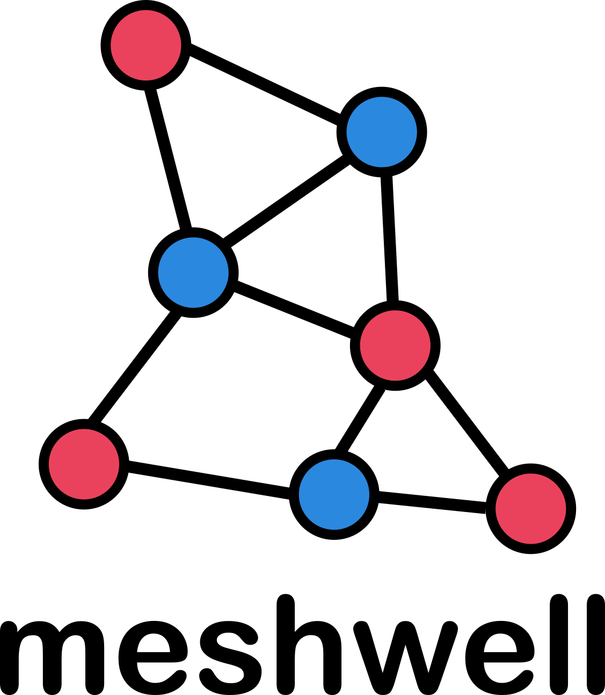

  

---

Meshwell is a Python wrapper around [GMSH](https://gmsh.info/) that provides:

(1) a Prism class that simplifies, to the point of automating, the definition of solids from arbitrary (multi)polygons with "buffered" extrusions;

(2) a simple API where such Prisms and regular GMSH OCC objects are specified in an ordered dictionary of mesh priority, and whose keys are then used to label the mesh entities and their interfaces unambiguously;

For instance:

<ADD EXAMPLE>

See the documentation for more information and examples. If you encounter a big, you can make an issue so we can improve the software over time. Contributions are also welcome, see open issues for current bugs and requested features.

### Background

This code was originally developed to define meshes out of the GDSII descriptions of integrated photonic circuits. A particularity of such devices is rich 2.5D topology, featuring multiple layers of smooth curves in the plane and etching profiles vertically.  Maxwell's equations (hence the name) are solved on these geometries to study how light propagates. It is also of critical interest to simulate how this is affected under other physical effects that can be resolved through finite-element or finite-volume analysis.

### Related projects
* [gdsfactory](https://github.com/gdsfactory/gdsfactory): open-source plugin-rich layout software
* [femwell](https://github.com/HelgeGehring/femwell): open-source scikit-fem based finite-element simulations, with emphasis on photonics
* [DEVSIM](https://github.com/devsim/devsim): open-source finite-volume simulator, with emphasis on semiconductor TCAD

### Other notable GMSH Python interfaces:
* [gmsh](https://gitlab.onelab.info/gmsh/gmsh): the gmsh Python API itself has significantly improved over the years
* [pygmsh](https://github.com/meshpro/pygmsh): manipulate Python objects instead of gmsh entity tags
* [objectgmsh](https://github.com/nemocrys/objectgmsh): class wrappers around entities

### Contributors
* Helge Gehring (Google X): beta testing, use cases, bug fixes
* Joaquin Matres Abril (Google X): code improvements
